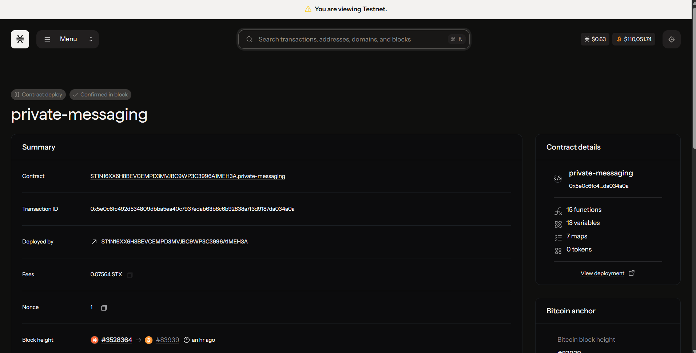

7# Private Messaging App (Clarity + Stacks)

## 1. Project Title
Private Messaging App (PMA) – A Web3, end-to-end encrypted, WhatsApp‑style messaging layer on Stacks.

### Contract details

Contract id - ST1N16XX6H8BEVCEMPD3MVJBC9WP3C3996A1MEH3A.private-messaging




## 2. Project Description
The Private Messaging App is a decentralized messaging protocol and reference smart contract built on the Stacks blockchain (settled on Bitcoin). It enables users to:

* Register a username and publish an encryption public key (used off-chain for E2E encryption via the Leather wallet or other clients).
* Send encrypted messages (ciphertext blobs) to other registered users with optional media hash references (e.g., IPFS / Arweave).
* Retrieve only the messages they participate in (ciphertext guarded by participant check) while anyone can read lightweight routing metadata (without ciphertext) if desired.
* Mark messages as read (basic read receipts), obtain inbox/sent counts, and paginate via per-user indexing maps.

All sensitive content is stored as opaque ciphertext. Actual encryption and key management occur client-side using the user’s published public key (e.g., generated through Leather). The on-chain contract guarantees ordering, integrity, participant access control to ciphertext, and open auditable metadata for message existence.

## 3. Project Vision
Create a censorship‑resistant, user‑owned messaging layer leveraging Bitcoin finality (through Stacks) while preserving user privacy via strong client-side encryption. The vision emphasizes:

* User Sovereignty: Identities mapped to Stacks principals; no centralized server controlling accounts.
* Privacy by Design: Only encrypted payloads on-chain; optional zero-knowledge or future FHE upgrades for richer private state.
* Interoperability: Open contract interface so multiple front-ends (web/mobile/CLI) can interoperate seamlessly.
* Extensibility: Modular approach allows adding features (group chats, reactions, media escrow, spam resistance) without breaking the base messaging primitives.
* Bitcoin Security Anchor: Settlement and ordering ultimately rooted in Bitcoin through Stacks, providing durable audit trails.

### Architectural Pillars
1. Identity & Keys: Users register username + secp256k1 compressed public key (33 bytes).
2. Messaging Core: Each message stored with sender, recipient, ciphertext, optional media hash, and block-height for ordering.
3. Indexing: Contract maintains per-user inbox/sent counters to enable deterministic pagination without full-chain scans.
4. Read Receipts: Simple boolean mapping—can be expanded to delivery receipts, reaction events, or ephemeral timers.
5. Events: `print` event on send for off-chain indexers / relayers.

## 4. Future Scope
Roadmap items to evolve toward a full “WhatsApp-like” experience while maintaining decentralization:

| Area | Enhancement | Description |
|------|-------------|-------------|
| Group Chats | Multi-participant threads | Introduce group identifiers, membership maps, and group message distribution rules. |
| Key Rotation | Secure updates | Add rotation history & grace periods for new public keys to mitigate compromised keys. |
| Ephemeral Messages | Time‑/read‑based expiry | Implement tombstoning events (cannot erase data, but can signal clients to hide). |
| Media Handling | Encrypted media pipelines | Off-chain encrypted storage with integrity proofs (hash commitments on-chain). |
| Spam Resistance | Staking / rate limits | Require minimal STX stake or token gating, implement anti-spam throttling. |
| Reactions & Threads | UX parity with Web2 | Lightweight reaction maps and parent-child references for message threading. |
| Search & Indexing | Off-chain indexing services | Deterministic event streams for advanced queries (full-text, time ranges). |
| Delivery Receipts | Distinguish delivered vs read | Additional state machine: sent -> delivered -> read. |
| Multi‑Device Sync | Deterministic key envelopes | Per-device subkeys published via profile extensions. |
| Advanced Privacy | ZK proofs, stealth addresses | Hide metadata (sender/recipient) with future L2 or ZK constructs. |
| Token Integration | Incentive layer | Optionally integrate credits / fees / reputation tokens. |
| Moderation Tools | User-controlled filters | Local blocklists and community-sourced spam heuristics. |

Additional security/privacy upgrades could include: metadata mixing, batching, or leveraging subnets/microblocks for lower latency; integration of threshold cryptography for group encryption.

## 5. Contract Address Details
Deployed (Testnet)

```
Network: testnet
Deployer Principal: ST1N16XX6H8BEVCEMPD3MVJBC9WP3C3996A1MEH3A
Contract Name: private-messaging
Contract Identifier: ST1N16XX6H8BEVCEMPD3MVJBC9WP3C3996A1MEH3A::private-messaging
Tx ID: (add txid here)  <-- PLEASE FILL IN
Deployment Block: (add block height)  <-- PLEASE FILL IN
Explorer Link: https://explorer.hiro.so/contract/ST1N16XX6H8BEVCEMPD3MVJBC9WP3C3996A1MEH3A.private-messaging?chain=testnet
```

## 6. Tech Stack

| Layer | Technology |
|-------|------------|
| Smart Contract | Clarity (Stacks, epoch 3.0, clarity_version 2) |
| Dev Tooling | Clarinet (deployment plans, simulation) |
| Frontend | React 18 + Vite 5 (TypeScript) |
| Wallet Integration | @stacks/connect, @stacks/transactions |
| Crypto (client-side placeholder) | tweetnacl / tweetnacl-util |
| Backend (optional) | Node.js + Express (helmet, compression, rate limiting) |
| Deployment (web) | GitHub Pages / Netlify compatible (SPA with _redirects) |
| Testing (contracts) | Vitest + vitest-environment-clarinet |

## 7. Setup Instructions (Dev)

Prerequisites: Node.js 20+, Clarinet installed, Leather wallet (Testnet mode).

Clone & install:
```
git clone <repo-url>
cd PrivateMessagingApp
cd web && npm install && cd ..
cd pma && npm install && cd ..
```

Run contract checks:
```
cd pma
clarinet check
```

Run frontend dev server:
```
cd web
cp .env.example .env   # then set VITE_CONTRACT_ADDRESS=ST...::private-messaging
npm run dev
```

Build frontend:
```
cd web
npm run build
```

Deploy contract (testnet) via Clarinet plan (ensure mnemonic in `pma/settings/Testnet.toml` and funded):
```
cd pma
clarinet deployments generate --testnet --output deployments/plan.testnet.yaml
clarinet deployments apply --testnet --plan deployments/plan.testnet.yaml --broadcast
```

Or use Explorer Sandbox (Testnet) to paste the contract and deploy.

## 8. How to Use
1. Connect your Stacks testnet wallet in the web app.
2. Register a username + public key (app triggers `register`).
3. Add another wallet/account, register it.
4. Send an encrypted (demo) message (triggers `send-message`).
5. Recipient loads inbox; dApp paginates via `get-inbox-count` + `get-inbox-message-id` + `get-message`.
6. Mark messages as read (`mark-read`) to update read receipts.


## 9. Submission Compliance Checklist

- [ ] Contract deployed on testnet (address documented above and in `contract-address.txt`).
- [ ] README includes title, description, tech stack, setup, usage, contract address.
- [ ] Clarity contract commented for logic clarity.
- [ ] Frontend present and buildable (React + Vite).
- [ ] All required directories present (`contracts/`, `web/`, `contract-address.txt`).
- [ ] Optional backend included (not required for core messaging logic).
- [ ] No private mnemonics committed (ignored via .gitignore rules).

If any item is unchecked, address it before final submission.


If you redeploy or version the contract, append additional entries instead of overwriting to preserve provenance.

## Repository Structure

```
PrivateMessagingApp/
  contracts/
    private-messaging.clar    # Core Clarity smart contract
  backend/                    # Optional helper API (Express)
    src/index.js
  web/                        # React + Vite front-end dApp
    src/
    index.html
  pma/                        # Clarinet scaffold (simnet/devnet)
  README.md                   # Project overview & documentation
```

## Smart Contract Overview

Core Maps / Vars:
* users: principal -> { username, pubkey }
* messages: id -> { sender, recipient, ciphertext, media-hash, block-height }
* inbox-index / sent-index: deterministic pagination
* inbox-counts / sent-counts: counters for O(1) size retrieval
* read-receipts: (message-id, user) -> bool
* message-counter: incremental ID

Key Public Functions:
* register(username, pubkey)
* update-profile(optional username, optional pubkey)
* send-message(recipient, ciphertext, optional media-hash) -> message-id
* mark-read(message-id)

Read-Only Functions:
* get-profile(user)
* get-inbox-count(user) / get-sent-count(user)
* get-inbox-message-id(user, index) / get-sent-message-id(user, index)
* get-message(id) – only sender or recipient gets ciphertext
* get-message-metadata(id) – public (no ciphertext)
* is-read(id)

## Leather (Wallet) Integration Notes

Front-end (not included here) can use `@stacks/connect` or `@stacks/wallet-sdk` to:
1. Prompt user authentication and obtain the principal.
2. Generate / retrieve an application-specific encryption key pair (or user-managed key) for message encryption (e.g., X25519 derived key, then store secp256k1 compressed key on-chain for identity binding).
3. On sending a message:
   * Fetch recipient profile (public key) via `get-profile`.
   * Encrypt message off-chain (e.g., asymmetric key exchange -> symmetric cipher like XChaCha20-Poly1305).
   * Chunk or compress to meet MAX-CIPHERTEXT-LEN; split across multiple messages if needed.
   * Broadcast `send-message` contract call transaction through Leather.
4. For reading:
   * Paginate using `get-inbox-count` + `get-inbox-message-id`.
   * For each id call `get-message` (only works if you are a participant) to retrieve ciphertext, decrypt locally, and mark read via `mark-read`.

## Local Development (Optional)

Use Clarinet for building & testing:
1. `clarinet new private-messaging-app` (if starting fresh)
2. Place `private-messaging.clar` in `contracts/`
3. Run `clarinet check` to verify syntax
4. Write tests in `tests/` using Typescript or Rust harness (`clarinet test`)

### Full Stack (Added)
Front-end (React) & backend scaffold included:

Backend:
```
cd backend
cp .env.example .env  # set CONTRACT_ADDRESS
npm install
npm run dev
```

Web dApp:
```
cd web
cp .env.example .env  # set VITE_CONTRACT_ADDRESS
npm install
npm run dev
```

Open the app, connect wallet, send an encrypted (demo) message.

## Security & Privacy Caveats
* Ciphertext visibility: All ciphertext is public; traffic analysis (who talks to whom, when, and message sizes) remains visible.
* No on-chain deletion: You can only append; “deletion” must be client convention.
* Rate limiting / spam: Not implemented—consider staking or per-block quotas.
* Key validation: Assumes clients supply valid secp256k1 compressed keys; no signature verification of publication is enforced here.

## License
MIT (add a LICENSE file if you distribute publicly).

## GitHub Pages Deployment

This repo includes an automated GitHub Actions workflow (`.github/workflows/deploy-web.yml`) that builds and deploys the `web/` front-end to GitHub Pages whenever you push to `main`.

### 1. Enable Pages
1. Go to GitHub repository Settings > Pages.
2. Set Source to GitHub Actions.

### 2. Provide Contract Address Secret
Add a repository secret so the build knows your deployed contract address:

Secrets & Variables > Actions > New repository secret:
  Name: `VITE_CONTRACT_ADDRESS`
  Value: `ST...::private-messaging`

Optional variable (Actions variable, not secret) if you deploy under a sub-path or fork name mismatch:
  Name: `VITE_BASE_PATH`
  Value: `/YourRepoName/`

### 3. (Optional) Override Other Env Vars
Add additional Actions variables if you want custom app name/icon:
  - `VITE_APP_NAME`
  - `VITE_APP_ICON`

### 4. Trigger Deployment
Push to `main` (or use the workflow_dispatch manual run). The workflow will:
  - Install dependencies
  - Build the Vite project with the supplied env
  - Upload & publish to Pages

### 5. SPA Routing
`404.html` is a copy of `index.html` and `.nojekyll` is added so client-side routing works on Pages.

### Local Build With Same Base Path
If your pages URL is `https://<user>.github.io/<repo>/`, set locally:
```
VITE_BASE_PATH=/<repo>/ npm run build
```
The produced assets will reference the correct public path.

---
This is a minimal on-chain core. Extend responsibly and test thoroughly before production deployment.

### Contract details

Contract id - ST1N16XX6H8BEVCEMPD3MVJBC9WP3C3996A1MEH3A.private-messaging

